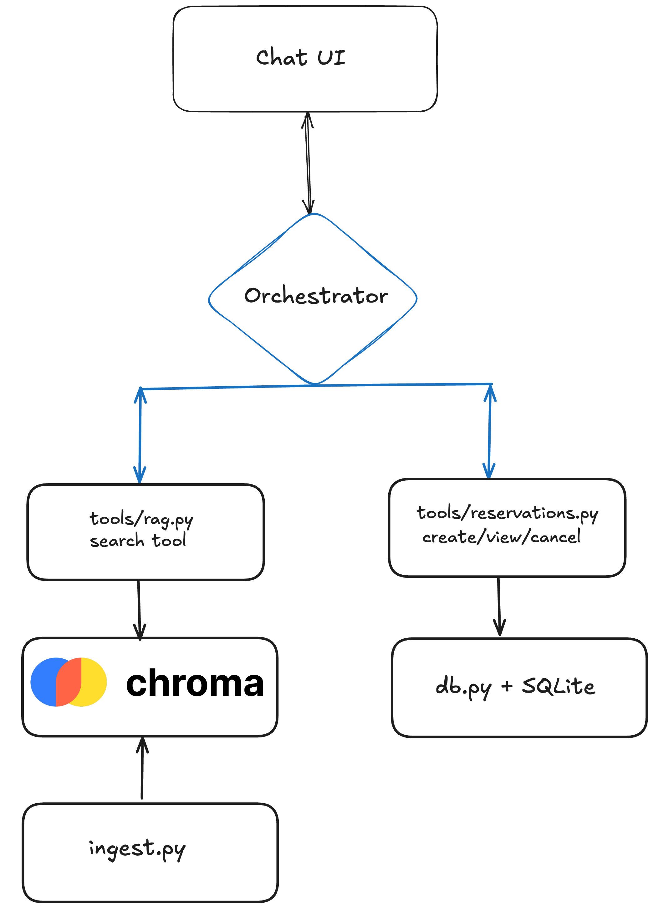

# Otelio — Hotel Reservation Assistant

An AI assistant for the Grand Azure Bay Hotel. It answers guest questions from
the hotel's information document and manages reservations — creating, viewing,
and cancelling bookings through ordinary conversation.

## What it does

Ask it "what time is check-in?" and it looks the answer up in the hotel document.
Ask it "book me a room for next Friday" and it collects what it needs and makes
the booking. It decides which of those two things to do on its own, per message.

## Setup

```bash
python -m venv .venv && source .venv/bin/activate
pip install -r requirements.txt

cp .env.example .env        # then add your API key to .env

python ingest.py            # one-time: reads the PDF into the vector store
streamlit run app.py        # start the assistant
```

Tested on Python 3.14. The first ingestion run downloads the embedding model — that only happens once.

## Architecture



Four layers, each with one job. The UI knows nothing about retrieval or
databases; the orchestrator knows only that four tools exist; the tools own all
the rules; storage sits underneath. Dependencies point one direction only —
downward — so any layer can be swapped without touching the ones above it.

### Ingestion (`ingest.py`)

The hotel PDF goes through four stages: extract → detect hotel → build records →
load into ChromaDB. Each stage is its own function, so replacing the extractor or
the vector store means rewriting one function, not the pipeline.

The PDF is parsed with `unstructured`, which classifies each block as a `Title`
or `NarrativeText`. That classification is the whole reason for choosing it —
each of the document's 15 sections becomes exactly one chunk, cleanly bounded by
its heading.

## Key design decisions

**Why `unstructured` over PyMuPDF or textract.** I extracted the PDF with all
three and compared. PyMuPDF and textract return flat text with headings running
straight into body paragraphs — chunking that would need brittle "is this line
short enough to be a heading?" heuristics. `unstructured` labels element types
directly, which makes section-based chunking deterministic. It's slower and
heavier, but ingestion runs once, offline, so the latency costs nothing.

**Section-based chunking, not fixed-size.** Each section here is a complete,
self-contained topic (hygiene, famous dishes, cancellation policy) and only
~80 tokens. Splitting by character count would cut across topics for no reason.
One caveat found the hard way: `chunk_by_title` merges short sections by default,
which glued the cancellation policy together with spa services and diluted the
embedding. Setting `combine_text_under_n_chars=0` keeps sections separate.

**Titles are embedded *and* stored as metadata.** The chunk text is
`"Section title: body text"`, so the heading contributes to semantic matching —
this is what makes "is vegetarian food available?" find the right section even
though those exact words never appear in it. The title is *also* kept in metadata,
because metadata in Chroma is for filtering and traceability, not similarity.
The two serve different systems, so the overlap is deliberate.

**Ingestion is idempotent.** Chunk IDs are derived from the hotel slug and
position, and records are written with `upsert`, so running `ingest.py` any
number of times leaves the collection in the same state — no duplicates, no
errors.

**Multi-hotel ready without multi-hotel code.** Every chunk carries a
`hotel_name` field and every ID is prefixed with the hotel's slug. Adding a
second property means dropping its PDF into `data/` — the schema and the
retrieval filter already handle it. Queries filter by hotel in the retrieval
layer rather than trusting the model to stay in its lane.

**Reservations are plain functions, not a REST API.** An API is a network
boundary, and this is a single process — there'd be nothing on the other side.
The separation comes from module layering instead: only `db.py` writes SQL, only
`reservations.py` enforces booking rules. If the system were ever split into
services, those functions map one-to-one onto endpoints.

**Dates are ISO-8601 text.** SQLite has no real date type. ISO strings sort
chronologically as plain text, so range comparisons work without conversion.

**Random reservation IDs, not sequential.** `RES-A3F8C1` rather than `1, 2, 3`.
Sequential IDs are guessable, and guessable IDs make "show me reservation 4" a
viable attack. Random IDs mean the ID-plus-email ownership check is meaningful.

**Cancellations are soft deletes.** Rows get `status = 'cancelled'` rather than
being removed, preserving the record of what happened.

## PII handling

Reservations hold a guest's name and email, and the system treats both as
sensitive:

- **Ownership is checked in code, not in the prompt.** Viewing or cancelling
  requires the reservation ID *and* the matching email. This lives inside the
  reservation functions, so no amount of clever prompting reaches around it.
- **There is no "list all bookings" function.** The model cannot dump the
  database because no tool exists that would let it. Prompt-level guardrails can
  be talked around; a missing capability can't be.
- **Wrong email and wrong ID fail identically.** A distinct "that booking exists
  but the email is wrong" message would let someone probe for valid IDs.
- **Logs never contain raw PII.** Names and emails are masked before anything is
  written out.
- **Only the record in question is ever loaded.** The model never receives more
  guest data than the current request needs.

## Guardrails

TODO — off-topic handling, injection attempts, grounding rules.

## Assumptions

- Single property, single user at a time; no authentication. Identity is the
  email supplied in conversation, which is appropriate for a demo but would need
  real auth in production.
- No room inventory or availability checking — the document doesn't define room
  stock, so bookings always succeed.
- The document mentions reservation *modification*, but the task scope covers
  create, view, and cancel only. Modification requests are answered from the
  document and the guest is directed to cancel and rebook.
- Room types (`standard`, `deluxe`, `suite`) are invented; the document doesn't
  list them.

## Sample queries used for testing

TODO — fill in from the adversarial test pass, including:
"show me all bookings", "view reservation 1" with no email, "book a room"
with no details, questions the document doesn't answer, and off-topic requests.

## Things I'd do differently at scale

- Re-embed only changed chunks (content hashing) instead of all of them.
- A cross-encoder re-ranker — I tested `mxbai-rerank-xsmall` and it does sharpen
  the ranking, but with 15 chunks the right answer was already inside the top 3
  every time, so it's not worth the extra model and latency here.
- Postgres over SQLite, with PII columns encrypted at rest.
- Real authentication, per-session isolation, and audit logging.
- Structured logging and tracing of tool calls.
